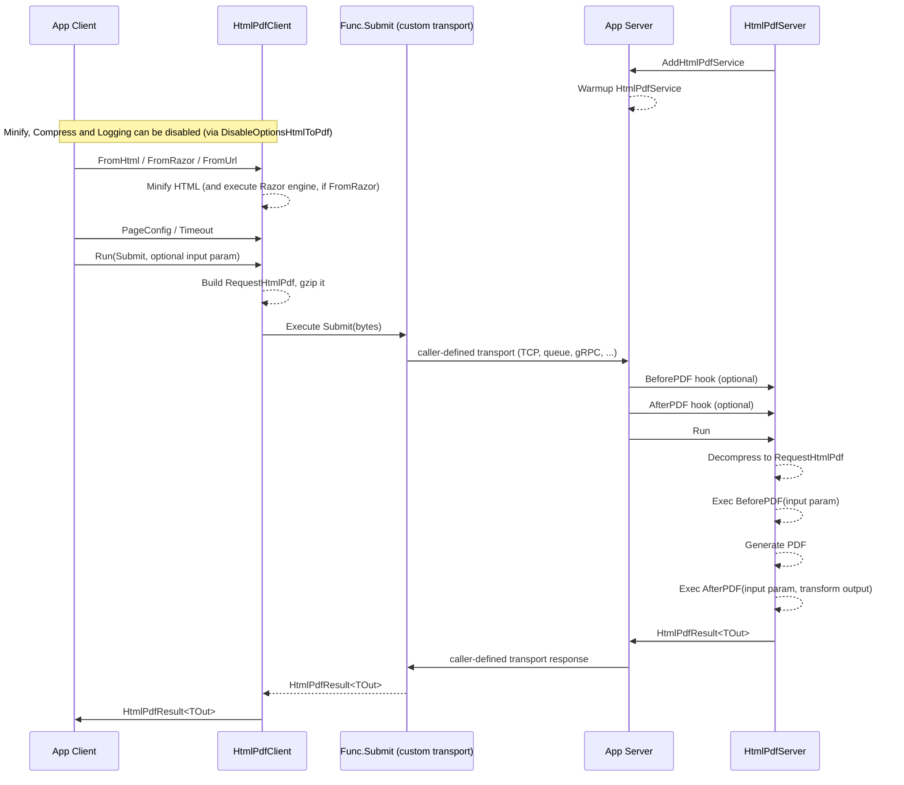
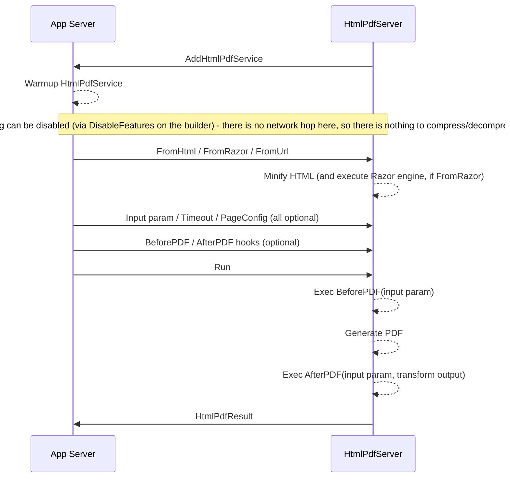

#  Welcome to HtmlPdfPlus

### **Lightweight and scalable HTML to PDF converter in .NET.** 


## The best tool to convert HTML to PDF in .NET with a modern engine

[](https://github.com/FRACerqueira/HtmlPdfPlus/actions/workflows/build.yml)
[](https://github.com/FRACerqueira/HtmlPdfPlus/actions/workflows/publish.yml)

- Client : [](https://www.nuget.org/packages/HtmlPdfPlus.Client/) [](https://www.nuget.org/packages/HtmlPdfPlus.Client/)
- Server : [](https://www.nuget.org/packages/HtmlPdfPlus.Server/) [](https://www.nuget.org/packages/HtmlPdfPlus.Server/)

## Table of Contents

- [Project Description](#project-description)
- [Features](#features)
- [Prerequisites](#prerequisites)
- [Installing](#installing)
- [Getting Started](#getting-started)
- [Usage](#usage)
- [Docker Usage](#docker-usage)
- [Examples](#examples)
- [Documentation](#documentation)
- [Code of Conduct](#code-of-conduct)
- [Contributing](#contributing)
- [Credits](#credits)
- [License](#license)
- [FAQ](#faq)

## Project Description
HtmlPdfPlus is a modern and lightweight library for **.Net10, .Net9 and .Net8** that allows you to convert HTML or RAZOR pages to PDF with high fidelity. 

It is a scalable and flexible solution that can be used in client-server mode or only server. It supports CSS and JavaScript, and it is easy to integrate with your application. 

You can customize the PDF settings, such as page size and margins, and add headers and footers to your PDF files. HtmlPdfPlus is a powerful tool that can help you generate PDF files from HTML or RAZOR pages with ease.

This library was built using the [Playwright](https://playwright.dev/dotnet/) (engine to automate **Chromium, Firefox, and WebKit** with a single API). Playwright is built to enable cross-browser web automation that is evergreen, capable, reliable, and fast. 

The current version (V.1.56.0) of **Playwright** supports **only the Chromium browser** for the PDF API.

## Features
[**Top**](#table-of-contents)

- Convert HTML or RAZOR page to PDF with high fidelity
- Support for CSS and JavaScript
- Asynchronous API
- Customizable PDF settings (e.g., page size, margins)
- Support for headers and footers
- Lightweight and easy to integrate 
- Flexible and scalable (Client-Server mode or only Server)
- Support HTML5 and CSS3
- Communicate with the server using REST API (with compressed request) or user custom protocol
- Minify HTML and CSS
- Client-side HTML parser with custom error action (optional)
- Compress send data over network
- Compress result PDF using GZip over network (Only type bytes array output)
- Extension on server side to customize the conversion process (before and after conversion)
    - BeforePDF : Normalize HTML, Replace tokens, etc
    - AfterPDF : Save file, Send to cloud, etc
- Disable features to improve/ balance performance (minify, compress and log)

### What's new
Current version: **2.0.0**. Full version history has moved to [CHANGELOG.md](./CHANGELOG.md).

## Prerequisites
[**Top**](#table-of-contents)

- .NET 8, .NET 9 or .NET 10 SDK
- Visual Studio 2022 or later
- Playwright (Installed and configured for your O.S)


## Installing
[**Top**](#table-of-contents)

### Installation Steps for Playwright (Windows)

```
dotnet tool update --global PowerShell
dotnet tool install --global Microsoft.Playwright.CLI
playwright.exe install --with-deps
```

_Note: Make sure that the path to the executable is mapped to: C:\Users\\[login]\\.dotnet\tools._

_If it is not, run it directly via the path C:\Users\\[login]\\.dotnet\tools\playwright.exe install --with-deps_

### Installation Steps for HtmlPdfPlus

**Client library** can be installed via NuGet or line command. 
```
Install-Package HtmlPdfPlus.Client [-pre]
```

```
dotnet add package HtmlPdfPlus.Client [--prerelease]
```

**Server library** can be installed via NuGet or line command. 


```
Install-Package HtmlPdfPlus.Server [-pre]
```

```
dotnet add package HtmlPdfPlus.Server [--prerelease]
```

**_Note:  [-pre]/[--prerelease] usage for pre-release versions_**

## Getting Started
[**Top**](#table-of-contents)

Follow these steps to get started with HtmlPdfPlus:

1. Install the necessary packages using NuGet.
2. Configure the services in your application.
3. Use the provided API to convert HTML to PDF.

## Usage
[**Top**](#table-of-contents)

It is possible to generate a PDF in two ways:

### 1) Using client-server mode

#### 1.1) Via http

```mermaid
sequenceDiagram
    participant AppClient as App Client
    participant HtmlPdfClient
    participant AppServer as App Server
    participant HtmlPdfServer

    HtmlPdfServer->>AppServer: AddHtmlPdfService
    AppServer-->>AppServer: Warmup HtmlPdfService

    Note over AppClient,HtmlPdfClient: Minify, Compress and Logging can be disabled (via DisableOptionsHtmlToPdf)

    AppClient->>HtmlPdfClient: FromHtml
    HtmlPdfClient-->>HtmlPdfClient: Minify HTML
    AppClient->>HtmlPdfClient: FromRazor
    HtmlPdfClient-->>HtmlPdfClient: Execute Razor engine, minify HTML
    AppClient->>HtmlPdfClient: FromUrl
    AppClient->>HtmlPdfClient: PageConfig / Timeout
    AppClient->>HtmlPdfClient: Run (optional input param)
    HtmlPdfClient-->>HtmlPdfClient: Build RequestHtmlPdf, gzip it
    HtmlPdfClient->>AppServer: HTTP POST (gzip bytes or plain JSON as the raw body)

    AppServer->>HtmlPdfServer: BeforePDF hook (optional)
    AppServer->>HtmlPdfServer: AfterPDF hook (optional)
    AppServer->>HtmlPdfServer: Run
    HtmlPdfServer-->>HtmlPdfServer: Decompress to RequestHtmlPdf
    HtmlPdfServer-->>HtmlPdfServer: Exec BeforePDF(input param)
    HtmlPdfServer-->>HtmlPdfServer: Generate PDF
    HtmlPdfServer-->>HtmlPdfServer: Exec AfterPDF(input param, transform output)
    HtmlPdfServer->>AppServer: HtmlPdfResult

    Note over AppServer,HtmlPdfClient: byte[] success -> raw PDF body (application/pdf); any other outcome -> ErrorInfo/HtmlPdfResult as JSON
    AppServer->>HtmlPdfClient: HTTP response
    HtmlPdfClient->>AppClient: HtmlPdfResult
```

#### basic usage client side

```csharp
using HtmlPdfPlus;

...
Host.CreateDefaultBuilder(args).ConfigureServices((hostContext, services) =>
{ 
   services.AddHttpClient("HtmlPdfServer", httpClient =>
   {
      httpClient.BaseAddress = new Uri("https://localhost:7212/GeneratePdf");
   });
});
...

//client http to endpoint    
var clienthttp = HostApp!.Services
	.GetRequiredService<IHttpClientFactory>()
	.CreateClient("HtmlPdfServer");

//create client instance and send to HtmlPdfPlus server endpoint    
var pdfresult = await HtmlPdfClient
    .Create("HtmlPdfPlusClient")
    .PageConfig((cfg) =>
    {
       cfg.Margins(10)
          .Footer("'<span style=\"text-align: center;width: 100%;font-size: 10px\"> <span class=\"pageNumber\"></span> of <span class=\"totalPages\"></span></span>")
          .Header("'<span style=\"text-align: center;width: 100%;font-size: 10px\" class=\"title\"></span>")
          .Orientation(PageOrientation.Landscape)
          .DisplayHeaderFooter(true);
     })
     .Logger(HostApp.Services.GetService<ILogger<Program>>())
     .FromHtml(HtmlSample())
     .Timeout(5000)
     .Run(clienthttp, applifetime.ApplicationStopping);

//performs writing to file after performing conversion
if (pdfresult.IsSuccess)
{
    await File.WriteAllBytesAsync("html2pdfsample.pdf", pdfresult.OutputData!);
}
else
{
    //show error via pdfresult.Error
}
```

#### basic usage Server side

```csharp
using HtmlPdfPlus;

...
var builder = WebApplication.CreateBuilder(args);
builder.Services.AddOpenApi();
builder.Services.AddHtmlPdfService((cfg) =>
{
    cfg.Logger(LogLevel.Debug, "MyPDFServer");
});
var app = builder.Build();
app.MapOpenApi();
...

// The request/response contract (raw PDF on success, structured ErrorInfo on failure) comes
// straight from the library, so the OpenAPI document generated above actually describes it.
app.MapHtmlPdfEndpoints("/GeneratePdf");

```


#### 1.2) Via any process


```mermaid
sequenceDiagram
    participant AppClient as App Client
    participant HtmlPdfClient
    participant Submit as Func.Submit (custom transport)
    participant AppServer as App Server
    participant HtmlPdfServer

    HtmlPdfServer->>AppServer: AddHtmlPdfService
    AppServer-->>AppServer: Warmup HtmlPdfService

    Note over AppClient,HtmlPdfClient: Minify, Compress and Logging can be disabled (via DisableOptionsHtmlToPdf)

    AppClient->>HtmlPdfClient: FromHtml / FromRazor / FromUrl
    HtmlPdfClient-->>HtmlPdfClient: Minify HTML (and execute Razor engine, if FromRazor)
    AppClient->>HtmlPdfClient: PageConfig / Timeout
    AppClient->>HtmlPdfClient: Run(Submit, optional input param)
    HtmlPdfClient-->>HtmlPdfClient: Build RequestHtmlPdf, gzip it
    HtmlPdfClient->>Submit: Execute Submit(bytes)
    Submit->>AppServer: caller-defined transport (TCP, queue, gRPC, ...)

    AppServer->>HtmlPdfServer: BeforePDF hook (optional)
    AppServer->>HtmlPdfServer: AfterPDF hook (optional)
    AppServer->>HtmlPdfServer: Run
    HtmlPdfServer-->>HtmlPdfServer: Decompress to RequestHtmlPdf
    HtmlPdfServer-->>HtmlPdfServer: Exec BeforePDF(input param)
    HtmlPdfServer-->>HtmlPdfServer: Generate PDF
    HtmlPdfServer-->>HtmlPdfServer: Exec AfterPDF(input param, transform output)
    HtmlPdfServer->>AppServer: HtmlPdfResult<TOut>
    AppServer->>Submit: caller-defined transport response
    Submit-->>HtmlPdfClient: HtmlPdfResult<TOut>
    HtmlPdfClient->>AppClient: HtmlPdfResult<TOut>
```

Unlike the HTTP path above, the wire format between `Submit` and `App Server` is entirely up to the caller's own `Submit` delegate - the library only hands it request bytes and expects an `HtmlPdfResult<TOut>` back, so there is no built-in compress/decompress step to describe on the response side (see [ClientSendTcp](./samples/ConsoleHtmlToPdfPlus.ClientSendTcp) for a working example over raw TCP).

#### basic usage client side

```csharp
using HtmlPdfPlus;

// Generic suggestion for writing a file to a cloud like gcp/azure
// Suggested return would be the full path "repo/filename"
var paramTosave = new DataSavePDF("Filename.pdf","MyRepo","MyConnectionstring");

var pdfresult = await HtmlPdfClient.Create("HtmlPdfPlusClient")
      .PageConfig((cfg) =>
      {
         cfg.Margins(10);
      })
      .Logger(HostApp.Services.GetService<ILogger<Program>>())
      .FromRazor(TemplateRazor(), order1)
      .Timeout(50000)
      .Run<DataSavePDF,string>(SendToServer,paramTosave, applifetime.ApplicationStopping);

//Shwo result
if (pdfresult.IsSuccess)
{
   Console.WriteLine($"File PDF generate at {pdfresult.OutputData}");
}
else
{
    Console.WriteLine($"HtmlPdfClient error: {pdfresult.Error!}");
}

private static async Task<HtmlPdfResult<string>> SendToServer(byte[] requestdata, CancellationToken token)
{
   //send requestdata to server and return result
}

```

#### basic usage Server side

```csharp
using HtmlPdfPlus;

...
var builder = WebApplication.CreateBuilder(args);  
builder.Services.AddHtmlPdfService<DataSavePDF,string>((cfg) =>
{
    cfg.Logger(LogLevel.Debug, "MyPDFServer");
});
...
var PDFserver = HostApp.Services.GetHtmlPdfService();

var result = await PDFserver
        .ScopeRequest(data)
        .BeforePDF( (html,inputparam, _) =>
        {
            if (inputparam is null)
            {
                return Task.FromResult(html);
            }
            //performs replacement token substitution in the HTML source before performing the conversion
            var aux = html.Replace("[{FileName}]", inputparam.Filename);
            return Task.FromResult(aux);
        })
        .AfterPDF( (pdfbyte, inputparam, token) =>
        {
            if (inputparam is null)
            {
                return Task.FromResult(string.Empty);
            }
            //TODO : performs writing to file  after performing conversion
            return Task.FromResult(inputparam.Filename);
        })
        .Run(token);

//send result to client

```

### 2) Using ony-server


```mermaid
sequenceDiagram
    participant AppServer as App Server
    participant HtmlPdfServer

    HtmlPdfServer->>AppServer: AddHtmlPdfService
    AppServer-->>AppServer: Warmup HtmlPdfService

    Note over AppServer,HtmlPdfServer: Minify and Logging can be disabled (via DisableFeatures on the builder) - there is no network hop here, so there is nothing to compress/decompress

    AppServer->>HtmlPdfServer: FromHtml / FromRazor / FromUrl
    HtmlPdfServer-->>HtmlPdfServer: Minify HTML (and execute Razor engine, if FromRazor)
    AppServer->>HtmlPdfServer: Input param / Timeout / PageConfig (all optional)
    AppServer->>HtmlPdfServer: BeforePDF / AfterPDF hooks (optional)
    AppServer->>HtmlPdfServer: Run

    HtmlPdfServer-->>HtmlPdfServer: Exec BeforePDF(input param)
    HtmlPdfServer-->>HtmlPdfServer: Generate PDF
    HtmlPdfServer-->>HtmlPdfServer: Exec AfterPDF(input param, transform output)
    HtmlPdfServer->>AppServer: HtmlPdfResult
```

#### basic usage
```csharp
using HtmlPdfPlus;

...
Host.CreateDefaultBuilder(args)
    .ConfigureServices((hostContext, services) =>
    {
        services.AddHtmlPdfService((cfg) =>
        {
               .Logger(LogLevel.Debug, "MyPDFServer")
               .DefaultConfig((page) =>
               {
                   page.DisplayHeaderFooter(true)
                       .Margins(10, 10, 10, 10);
               });
        });
    });
...

//instance of Html to Pdf Engine and Warmup HtmlPdfServerPlus
var PDFserver = HostApp!.Services.GetHtmlPdfService();

//Performs conversion and custom operations on the server
var pdfresult = await PDFserver
       .ScopeData()
       .FromHtml(HtmlSample(),5000)
       .Run(applifetime.ApplicationStopping);

//performs writing to file after performing conversion
if (pdfresult.IsSuccess)
{
    await File.WriteAllBytesAsync( "html2pdf.pdf", pdfresult.OutputData!);
}
else
{
    //show error via pdfresult.Error
}
```

# Docker Usage
[**Top**](#table-of-contents)

The use of Playwright works very well for local testing on Windows machines following the standard installation instructions.

For containerization scenarios, image sizes are a challenge that deserves more dedicated attention.

> **2026-08 correction.** The [Dockerfile](./Dockerfile) had been broken since 2025-11-13 (commit `93be7db`): a malformed Chrome download URL made the image fail to build at all, so the "~70% smaller" claim previously made here described an image nobody could actually produce. Investigating it surfaced a second, more important problem: the code launches Chromium with `Headless = true` and no `Channel`, which Playwright always resolves to its own bundled `chromium_headless_shell` binary - **the separately apt-installed Google Chrome was never used**, at any point. It only ever added dead weight. The Dockerfile has been rewritten around this; see below for what changed and the real, measured numbers.

**What actually makes the image small now:**
- Keep only the one Playwright-bundled browser variant the code launches - `chromium_headless_shell` - and delete the full desktop `chromium`, `firefox`, `webkit` and `ffmpeg` builds that ship alongside it but are never referenced. No separate browser is installed via `apt`.
- The build-stage image tag (`mcr.microsoft.com/playwright/dotnet:v1.62.0`) is kept in lockstep with the `Microsoft.Playwright` NuGet package version referenced by [`HtmlPdfPlus.Server.csproj`](./src/HtmlPdfPlus.Server/HtmlPdfPlus.Server.csproj) - a mismatch here is exactly what caused the container to crash on startup during this investigation (Playwright refuses to launch a browser revision that doesn't match its own driver, and says so explicitly in the exception). **Bumping that NuGet package without bumping this tag will break the container the same way - keep them together.**
- The final stage's dependency list (`libnss3`, `libatk-bridge2.0-0t64`, etc.) was derived by running `ldd` against the actual `chromium_headless_shell` binary, not copied from generic documentation - Ubuntu Noble's `libasound2` → `libasound2t64` package rename, for example, is easy to get wrong by guessing.
- Both build and runtime stages target the same Ubuntu Noble base (`aspnet:10.0-noble` instead of the Debian-based default `aspnet:10.0`), so the browser binary runs on the same glibc family it was built and validated against.

**Measured, not estimated:** built and booted both versions end-to-end (container start, page-pool warmup, a real `POST /GeneratePdf` producing a valid PDF) to confirm correctness before comparing size.

| | Image size |
|---|---|
| Previous approach, with only the broken URL fixed (still boots into a crash) | 763 MB |
| Current [Dockerfile](./Dockerfile) | **370 MB** |

I believe this work can still be improved! **For reference on this approach, see the [Dockerfile](./Dockerfile)**.


## Examples
[**Top**](#table-of-contents)

Each sample is scoped to one clear lesson. For more examples, please refer to the [Samples directory](./samples):

- **Server Only** - no client, no network, HTML/URL converted in the same process
	- [OnlyAtServer/CustomHooks](./samples/ConsoleHtmlToPdfPlus.OnlyAtServer/CustomHooks) - `BeforePDF`/`AfterPDF` hooks (token substitution, custom file output), typed `TIn`/`TOut`, and `DisableOptionsHtmlToPdf.DisableCompress` for same-process performance
	- [OnlyAtServer/QuickStart](./samples/ConsoleHtmlToPdfPlus.OnlyAtServer/QuickStart) - the minimal default setup: `byte[]` output, both `FromHtml` and `FromUrl` render modes, no hooks
- **Client-Server (HTTP)** - client and server as separate processes over `HttpClient`
	- [ClientSendHttp](./samples/ConsoleHtmlToPdfPlus.ClientSendHttp) - one client walking through all three content sources (`FromHtml`, `FromRazor` with a typed model, `FromUrl`) against the same generic server
	- [WebHtmlToPdf.GenericServer](./samples/WebHtmlToPdf.GenericServer) - the server side: `MapHtmlPdfEndpoints()`, `AddOpenApi()`, and the health endpoints, in as few lines as the library allows
- **Client-Server Custom** - customizing what the server returns instead of raw PDF bytes
	- [ClientCustomSendHttp](./samples/ConsoleHtmlToPdfPlus.ClientCustomSendHttp) - typed input/output (`DataSavePDF`) standing in for "save the PDF to cloud storage, return its path"
	- [WebHtmlToPdf.CustomSaveFileServer](./samples/WebHtmlToPdf.CustomSaveFileServer) - the matching server: token substitution via `BeforePDF`, then `AfterPDF` turning the PDF bytes into a saved-file result
- **Client-Server TCP** - swapping the transport for a non-HTTP one (⚠ demonstrates shipping flexibility only, not production-ready)
	- [ClientSendTcp](./samples/ConsoleHtmlToPdfPlus.ClientSendTcp) - the client's `Run(Func<byte[],...>)` overload driving a raw TCP round-trip via [SuperSimpleTcp](https://github.com/jchristn/SuperSimpleTcp)
	- [TcpServerHtmlToPdf.GenericServer](./samples/TcpServerHtmlToPdf.GenericServer) - the matching TCP listener, unpacking a request and writing the result back over the same connection
- **Cross-language** - consuming the server from outside .NET
	- [JavaClientSendHttp](./samples/JavaClientSendHttp) - a single dependency-free `.java` file (JDK's own `HttpClient` + `GZIPOutputStream`, no build tool) showing the exact wire format any non-.NET client must produce: JSON → gzip → POST as `application/octet-stream` - see the file header for the `javac`/`java` commands and which server profile to run
- **Production readiness** - the v2 roadmap features, each with a deliberately tiny page pool (`PagesBuffer(1)`) so the behavior being demonstrated is easy to reproduce on any machine instead of depending on real render timing
	- [RetryAfterBackpressure](./samples/ConsoleHtmlToPdfPlus.RetryAfterBackpressure) - firing concurrent requests, detecting `ErrorCode.PoolExhausted`, and backing off using `ErrorInfo.RetryAfterSeconds` before retrying
	- [MetricsObserver](./samples/ConsoleHtmlToPdfPlus.MetricsObserver) - attaching a `MeterListener` (no OTel/exporter package needed) to observe the instruments a healthy run produces (`htmlpdfplus.pool.available_pages`, `.request.duration`, `.errors`, `.pool.acquire_wait`), including how a validation failure increments `htmlpdfplus.errors` without touching `htmlpdfplus.request.duration` - `htmlpdfplus.browser.restarts` only appears after an unexpected disconnect, so it stays silent here

> `/healthz` and `/readyz` are mapped by the two web server samples above (via `MapHtmlPdfHealthEndpoints()`), but no sample calls them from a client or shows what a real orchestrator would do with the response. See the [resilience guide](docs/guide/resilience.md) for how they work until a dedicated sample exists.

## Documentation
[**Top**](#table-of-contents)

The library is well documented and has a main namespace `HtmlPdfPlus` for client and server, and all methods use fluent interface. 

The documentation is available in the [Docs directory](./src/docs/docindex.md).

## Code of Conduct
[**Top**](#table-of-contents)

This project has adopted the code of conduct defined by the Contributor Covenant to clarify expected behavior in our community.
For more information see the [Code of Conduct](CODE_OF_CONDUCT.md).

## Contributing
[**Top**](#table-of-contents)

Please read [Contributing](CONTRIBUTING.md) for details on our code of conduct, and the process for submitting pull requests to us.

## Credits
[**Top**](#table-of-contents)

**API documentation generated by**

- [XmlDocMarkdown](https://github.com/ejball/XmlDocMarkdown), Copyright (c) 2024 [Ed Ball](https://github.com/ejball)
    - See an unrefined customization to contain header and other adjustments in project [XmlDocMarkdownGenerator](https://github.com/FRACerqueira/HtmlPdfPLus/tree/main/src/XmlDocMarkdownGenerator)  
    
## License
[**Top**](#table-of-contents)

This project is licensed under the MIT License - see the [License](LICENSE.md) file for details.

**Disclaimer** : HtmlPdfPlus **<u>includes PackageReference</u>** from other software released under other licences:

- [NUglify](https://github.com/trullock/NUglify) released under the [BSD-Clause 2 license](http://opensource.org/licenses/BSD-2-Clause).
   - The original Microsoft Ajax Minifier was released under the [Apache 2.0 license](http://www.apache.org/licenses/LICENSE-2.0).

## FAQ
[**Top**](#table-of-contents)

**Q: What browsers are supported for PDF generation?**

A: Currently, only the Chromium browser is supported for the PDF API.

**Q: What init args for speed and reduce resource usage ?**

A: Currently, HtmlPdfPlus.Server starts with "--run-all-compositor-stages-before-draw --disable-dev-shm-usage -disable-setuid-sandbox --no-sandbox" when no argument value is passed.

**Q: Can I customize the PDF settings?**

A: Yes, you can customize settings such as page size, margins, headers, and footers.

**Q: Is there support for asynchronous operations?**

A: Yes, the API supports asynchronous operations.

**Q: How can I contribute to the project?**

A: Please refer to the [Contributing](CONTRIBUTING.md) section for details on how to contribute.
