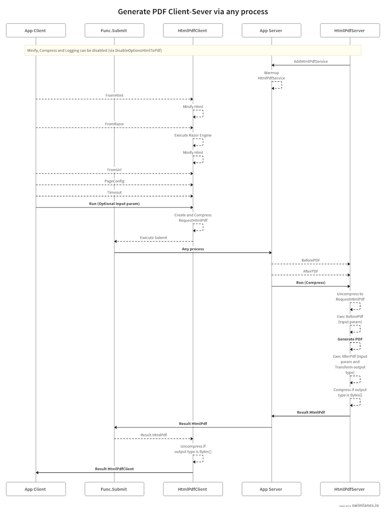
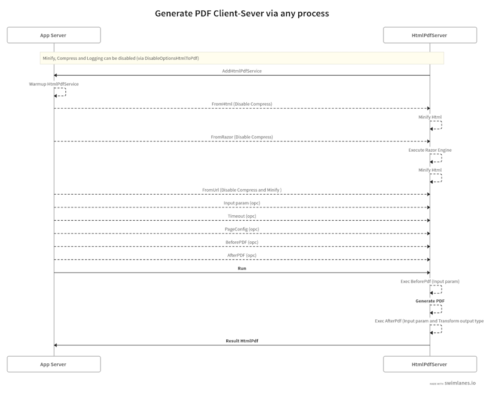

# Welcome to HtmlPdfPlus

**Lightweight and scalable HTML to PDF converter in .NET.**  over Open Source library with an [MIT license](https://en.wikipedia.org/wiki/MIT_License).

[](https://www.nuget.org/packages/HtmlPdfPlus/)
[](https://www.nuget.org/packages/HtmlPdfPlus/)


## Table of Contents

- [Features](#features)
- [Installing](#installing)
- [Usage](#usage)
- [Examples](#examples)
- [Code of Conduct](#code-of-conduct)
- [Contributing](#contributing)
- [License](#license)

## Features
[**Top**](#table-of-contents)

- Convert HTML or RAZOR page to PDF with high fidelity
- Support for CSS and JavaScript
- Asynchronous API
- Customizable PDF settings (e.g., page size, margins)
- Support for headers and footers
- Lightweight and easy to integrate 
- Flexible and scalable (Client-Server mode or only Server)
- Support HTML5 and CSS3
- Communicate with the server using REST API (with compressed request) or user custom protocol
- Minify HTML and CSS
- Compress PDF using GZip over network (Only type bytes array output)


#### What's new in the latest version

- Initial version


## Installing
[**Top**](#table-of-contents)

**Client library** can be installed via NuGet or line command. 
```
Install-Package HtmlPdfPlus.Client [-pre]
```

```
dotnet add package HtmlPdfPlus.Client [--prerelease]
```

**_Note:  [-pre]/[--prerelease] usage for pre-release versions_**


```
Install-Package HtmlPdfPlus.Server [-pre]
```

```
dotnet add package HtmlPdfPlus.Server [--prerelease]
```

**_Note:  [-pre]/[--prerelease] usage for pre-release versions_**

## Usage
[**Top**](#table-of-contents)

It is possible to generate a PDF in three ways:

#### 1) Via http using client-server mode


#### 2) Via any process using client-server mode



#### 3) Via any process using ony-server mode



## Examples
[**Top**](#table-of-contents)

For more examples, please refer to the [Samples directory](../Samples) :

- [Console HtmlToPdfPlus OnlyAtServer V1](../Samples/ConsoleHtmlToPdfPlus.OnlyAtServerV1)


## Code of Conduct
[**Top**](#table-of-contents)

This project has adopted the code of conduct defined by the Contributor Covenant to clarify expected behavior in our community.
For more information see the [Code of Conduct](CODE_OF_CONDUCT.md).

## Contributing
[**Top**](#table-of-contents)

Please read [Contributing](CONTRIBUTING.md) for details on our code of conduct, and the process for submitting pull requests to us.

## License
[**Top**](#table-of-contents)

This project is licensed under the MIT License - see the [License](LICENSE.md) file for details.

**Disclaimer** : HtmlPdfPlus **<u>includes PackageReference</u>** from other software released under other licences:

- [NUglify](https://github.com/trullock/NUglify) released under the [BSD-Clause 2 license](http://opensource.org/licenses/BSD-2-Clause).
   - The original Microsoft Ajax Minifier was released under the [Apache 2.0 license](http://www.apache.org/licenses/LICENSE-2.0).
