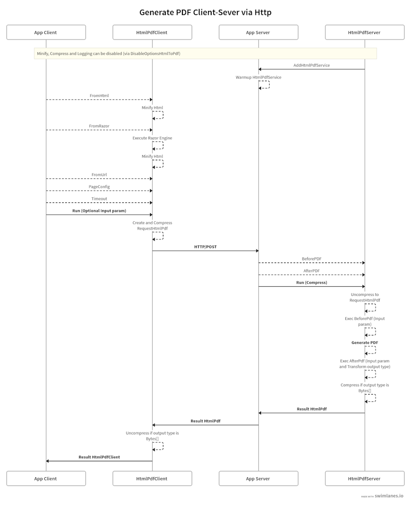

# Welcome to HtmlPdfPlus

### **Lightweight and scalable HTML to PDF converter in .NET.** 


## The best tool to convert HTML to PDF in .NET with a modern engine

#### | Client -> [](https://www.nuget.org/packages/HtmlPdfPlus.Client/) [](https://www.nuget.org/packages/HtmlPdfPlus.Client/)

#### | Server -> [](https://www.nuget.org/packages/HtmlPdfPlus.Server/) [](https://www.nuget.org/packages/HtmlPdfPlus.Server/)

## Table of Contents

- [Project Description](#project-description)
- [Features](#features)
- [Prerequisites](#prerequisites)
- [Installing](#installing)
- [Getting Started](#getting-started)
- [Usage](#usage)
- [Examples](#examples)
- [Documentation](#documentation)
- [Code of Conduct](#code-of-conduct)
- [Contributing](#contributing)
- [License](#license)

## Project Description
HtmlPdfPlus is a modern and lightweight library that allows you to convert HTML or RAZOR pages to PDF with high fidelity. It is a scalable and flexible solution that can be used in client-server mode or only server. It supports CSS and JavaScript, and it is easy to integrate with your application. You can customize the PDF settings, such as page size and margins, and add headers and footers to your PDF files. HtmlPdfPlus is a powerful tool that can help you generate PDF files from HTML or RAZOR pages with ease.

This library was built using the [Playwright](https://playwright.dev/dotnet/) (engine to automate **Chromium, Firefox, and WebKit** with a single API). Playwright is built to enable cross-browser web automation that is evergreen, capable, reliable, and fast. 

The current version (V.1.50.0) of **Playwright** supports **only the Chromium browser** for the PDF API.

## Features
[**Top**](#table-of-contents)

- Convert HTML or RAZOR page to PDF with high fidelity
- Support for CSS and JavaScript
- Asynchronous API
- Customizable PDF settings (e.g., page size, margins)
- Support for headers and footers
- Lightweight and easy to integrate 
- Flexible and scalable (Client-Server mode or only Server)
- Support HTML5 and CSS3
- Communicate with the server using REST API (with compressed request) or user custom protocol
- Minify HTML and CSS
- Compress PDF using GZip over network (Only type bytes array output)
- Extension on server side to customize the conversion process (before and after conversion)
    - BeforePDF : Normalize HTML, Replace tokens, etc
    - AfterPDF : Save file, Send to cloud, etc
- Disable features to improve/ balance performance (minify, compress, etc)

#### What's new in the latest version

- Initial version

## Prerequisites
[**Top**](#table-of-contents)

- .NET 8 or .NET 9 SDK
- Visual Studio 2022 or later
- Playwright (for PDF generation)


## Installing
[**Top**](#table-of-contents)

**Client library** can be installed via NuGet or line command. 
```
Install-Package HtmlPdfPlus.Client [-pre]
```

```
dotnet add package HtmlPdfPlus.Client [--prerelease]
```

**Server library** can be installed via NuGet or line command. 


```
Install-Package HtmlPdfPlus.Server [-pre]
```

```
dotnet add package HtmlPdfPlus.Server [--prerelease]
```

**_Note:  [-pre]/[--prerelease] usage for pre-release versions_**

## Getting Started
[**Top**](#table-of-contents)

Follow these steps to get started with HtmlPdfPlus:

1. Install the necessary packages using NuGet.
2. Configure the services in your application.
3. Use the provided API to convert HTML to PDF.

## Usage
[**Top**](#table-of-contents)

It is possible to generate a PDF in two ways:

### 1) Using client-server mode

#### 1.1) Via http



#### basic usage client side

```csharp
using HtmlPdfPlus;

...
Host.CreateDefaultBuilder(args).ConfigureServices((hostContext, services) =>
{ 
   services.AddHttpClient("HtmlPdfServer", httpClient =>
   {
      httpClient.BaseAddress = new Uri("https://localhost:7212/GeneratePdf");
   });
});
...

//client http to endpoint    
var clienthttp = HostApp!.Services
	.GetRequiredService<IHttpClientFactory>()
	.CreateClient("HtmlPdfServer");

//create client instance and send to HtmlPdfPlus server endpoint    
var pdfresult = await HtmlPdfClient.Create("HtmlPdfPlusClient")
    .PageConfig((cfg) => cfg.Margins(10))
    .FromHtml(HtmlSample())
    .Timeout(5000)
    .Run(clienthttp, token);

//performs writing to file after performing conversion
if (pdfresult.IsSuccess)
{
    await File.WriteAllBytesAsync("html2pdfsample.pdf", pdfresult.OutputData!);
}
else
{
    //show error via pdfresult.Error
}
```

#### basic usage Server side

```csharp
using HtmlPdfPlus;

...
var builder = WebApplication.CreateBuilder(args);  
builder.Services.AddHtmlPdfService((cfg) =>
{
    cfg.Logger(LogLevel.Debug, "MyPDFServer");
});
...

app.MapPost("/GeneratePdf", async ([FromServices] IHtmlPdfServer<object, byte[]> PDFserver, [FromBody] string requestclienthtmltopdf, CancellationToken token) =>
{
    return await PDFserver.Run(requestclienthtmltopdf, token);
}).Produces<HtmlPdfResult<byte[]>>(200);

```


#### 1.2) Via any process


#### basic usage client side

```csharp
using HtmlPdfPlus;

//create client instance and send to HtmlPdfPlus server endpoint    
var pdfresult = await HtmlPdfClient.Create("HtmlPdfPlusClient")
    .PageConfig((cfg) => cfg.Margins(10))
    .FromHtml(HtmlSample())
    .Timeout(5000)
    .Run(SendToServer, token);

//performs writing to file after performing conversion
if (pdfresult.IsSuccess)
{
    await File.WriteAllBytesAsync("html2pdfsample.pdf", pdfresult.OutputData!);
}
else
{
    //show error via pdfresult.Error
}

private static async Task<HtmlPdfResult<byte[]>> SendToServer(string requestdata, CancellationToken token)
{
   //send requestdata to server and return result
}

```

#### basic usage Server side

```csharp
using HtmlPdfPlus;

...
var builder = WebApplication.CreateBuilder(args);  
builder.Services.AddHtmlPdfService((cfg) =>
{
    cfg.Logger(LogLevel.Debug, "MyPDFServer");
});
...
var PDFserver = HostApp.Services.GetHtmlPdfService();

var result = await PDFserver.Run(requestdata , Token);

//send result to client

```

### 2) Using ony-server


#### basic usage
```csharp
using HtmlPdfPlus;

...
Host.CreateDefaultBuilder(args)
    .ConfigureServices((hostContext, services) =>
    {
        services.AddHtmlPdfService((cfg) =>
        {
            //when run in the same context, not Compress is fast because it is not required to transfer data over the network
            cfg.DisableFeatures(DisableOptionsHtmlToPdf.DisableCompress);
               .Logger(LogLevel.Debug, "MyPDFServer")
               .DefaultConfig((page) =>
               {
                   page.DisplayHeaderFooter(true)
                       .Margins(10, 10, 10, 10);
               });
        });
    });
...

//instance of Html to Pdf Engine and Warmup HtmlPdfServerPlus
var PDFserver = HostApp!.Services.GetHtmlPdfService();

//create a request with default configuration and without compression to the server 
//when run in the same context, not Compress is fast because it is not required to transfer data over the network
var request = RequestHtmlPdf.Create(HtmlSample(), compress: false);

//Performs conversion on the server
var pdfresult = await PDFserver.Run(request, applifetime.ApplicationStopping);

//performs writing to file after performing conversion
if (pdfresult.IsSuccess)
{
    await File.WriteAllBytesAsync( "html2pdf.pdf", pdfresult.OutputData!);
}
else
{
    //show error via pdfresult.Error
}
```

## Examples
[**Top**](#table-of-contents)

For more examples, please refer to the [Samples directory](../Samples) :

- Server Only
	- [Console HtmlToPdfPlus OnlyAtServer V1](../Samples/ConsoleHtmlToPdfPlus.OnlyAtServer/v1)
        - Performs replacement token substitution in the HTML source before performing the conversion 
        - Performs writing to file after performing conversion
        - Return output data with filename
	- [Console HtmlToPdfPlus OnlyAtServer V2](../Samples/ConsoleHtmlToPdfPlus.OnlyAtServer/v2)
        - Performs generate pdf in bytes array
        - Performs writing to file
- Client-Server
	- [Console HtmlToPdfPlus Client by Http](../Samples/ConsoleHtmlToPdfPlus.ClientSendHttp)
        - Performs sending data to the server via http
        - Performs writing to file
	- [Server HtmlToPdfPlus Generic](../Samples/WebHtmlToPdf.GenericServer)
        - Performs generate pdf in bytes array
- Client-Server Custom
	- [Console HtmlToPdfPlus Client Custom by Http](../Samples/ConsoleHtmlToPdfPlus.ClientCustomSendHttp)
        - Performs a generic suggestion for writing a file to a cloud like gcp/azure   
	- [Server HtmlToPdfPlus Custom Save File](../Samples/WebHtmlToPdf.CustomSaveFileServer)
        - Performs replacement token substitution in the HTML source before performing the conversion 
        - Performs a generic suggestion writing to file after performing conversion
- Client-Server TCP
	- [Console HtmlToPdfPlus Client Tcp](../Samples/ConsoleHtmlToPdfPlus.ClientSendTcp)
        - Performs sending data to the server via tcp-client
        - Performs writing to file
 	- [Server Console HtmlToPdfPlus Tcp](../Samples/TcpServerHtmlToPdf.GenericServer)
	    - Performs generate pdf in bytes array via tcp-server

        - 
## Documentation
[**Top**](#table-of-contents)

The library is well documented and has a main namespace `HtmlPdfPlus` for client and server, and all methods use fluent interface:

The documentation is available in the [Docs directory](./src/docs/docindex.md).

## Code of Conduct
[**Top**](#table-of-contents)

This project has adopted the code of conduct defined by the Contributor Covenant to clarify expected behavior in our community.
For more information see the [Code of Conduct](CODE_OF_CONDUCT.md).

## Contributing
[**Top**](#table-of-contents)

Please read [Contributing](CONTRIBUTING.md) for details on our code of conduct, and the process for submitting pull requests to us.

## License
[**Top**](#table-of-contents)

This project is licensed under the MIT License - see the [License](LICENSE.md) file for details.

**Disclaimer** : HtmlPdfPlus **<u>includes PackageReference</u>** from other software released under other licences:

- [NUglify](https://github.com/trullock/NUglify) released under the [BSD-Clause 2 license](http://opensource.org/licenses/BSD-2-Clause).
   - The original Microsoft Ajax Minifier was released under the [Apache 2.0 license](http://www.apache.org/licenses/LICENSE-2.0).

## FAQ
[**Top**](#table-of-contents)

**Q: What browsers are supported for PDF generation?**
A: Currently, only the Chromium browser is supported for the PDF API.

**Q: Can I customize the PDF settings?**
A: Yes, you can customize settings such as page size, margins, headers, and footers.

**Q: Is there support for asynchronous operations?**
A: Yes, the API supports asynchronous operations.

**Q: How can I contribute to the project?**
A: Please refer to the [Contributing](CONTRIBUTING.md) section for details on how to contribute.