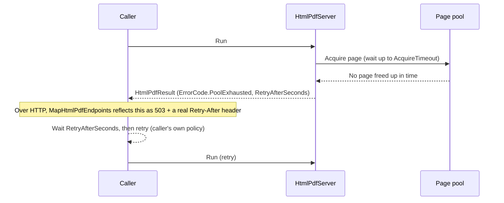
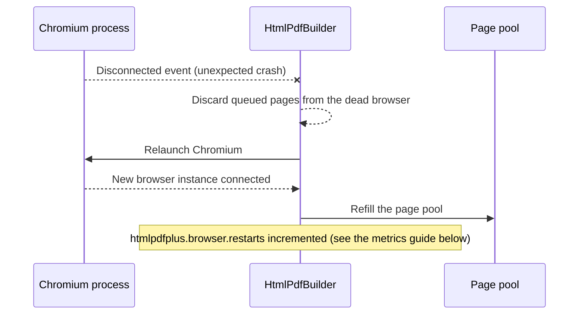
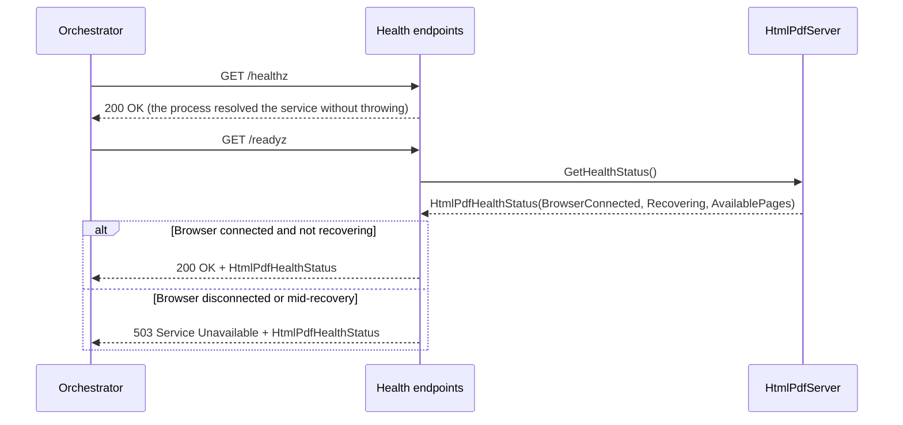

### Resilience and observability

The three flows in the main [README](../../README.md#usage) show who calls whom for each transport. This page covers the flows that cut across all three transports: what happens when the page pool is saturated, when the underlying browser process dies, and how a host observes renderer health from outside. None of these are new transports - they are the same `Run()` call reacting to a specific condition.

#### Backpressure and Retry-After

The page pool has a finite number of pages (`PagesBuffer`). When every page is busy and none frees up within `AcquireTimeout`, the request fails with `ErrorCode.PoolExhausted` instead of blocking indefinitely or failing silently. The library never retries this internally - it signals the condition and leaves the retry decision entirely to the caller (see [ADR-004](../adr/ADR004V01R01-signal-backpressure-instead-of-retrying-internally.md)).

See the [RetryAfterBackpressure](../../samples/ConsoleHtmlToPdfPlus.RetryAfterBackpressure) sample for a working caller-owned retry loop.

#### Automatic browser recovery

If the underlying Chromium process dies unexpectedly (a crash, being killed by the OS under memory pressure, etc.), the page pool detects the disconnect and relaunches the browser instead of failing every request that follows. Concurrent disconnect notifications from multiple pages collapse into a single recovery attempt.

Requests that arrive mid-recovery see `HtmlPdfHealthStatus.Recovering = true` via the readiness endpoint below, rather than an opaque failure.

#### Health and readiness

`MapHtmlPdfHealthEndpoints()` maps two endpoints with deliberately different meanings: liveness answers "is the process itself responsive", readiness answers "can this instance actually render right now".

Liveness deliberately never inspects the browser/pool: a crashed browser is a readiness concern (pull this instance out of rotation while it self-heals), not a liveness one (restarting the whole process would only discard an in-progress auto-recovery). A momentarily empty pool is likewise still "ready" - that is what the backpressure signal above is for, not a readiness failure.

#### Metrics

Every instance publishes instruments under the `HtmlPdfPlus` meter via `System.Diagnostics.Metrics` - no bundled exporter, so any OpenTelemetry-compatible backend can consume them with a single `AddMeter("HtmlPdfPlus")` call (see [ADR-005](../adr/ADR005V01R01-metrics-via-system-diagnostics-metrics-with-no-bundled-exporter.md)):

| Instrument | Kind | Tags | What it tells you |
| --- | --- | --- | --- |
| `htmlpdfplus.pool.available_pages` | Observable gauge | `sourcealias` | Current pool depth |
| `htmlpdfplus.pool.acquire_wait` | Histogram (ms) | `sourcealias`, `outcome` (`acquired`/`pool_exhausted`/`canceled`) | Time spent waiting for a page |
| `htmlpdfplus.request.duration` | Histogram (ms) | `sourcealias`, `success` | Render + hook time for requests that reached a render attempt |
| `htmlpdfplus.errors` | Counter | `sourcealias`, `error_code` | Failures by `ErrorCode`, including request-level validation failures |
| `htmlpdfplus.browser.restarts` | Counter | `sourcealias` | Automatic browser relaunches after an unexpected disconnect |

See the [MetricsObserver](../../samples/ConsoleHtmlToPdfPlus.MetricsObserver) sample for a working `MeterListener` that needs no exporter package at all.

### See Also
* [Main README](../../README.md)
* [Architecture Decision Records](../adr/indexadrs.md)
